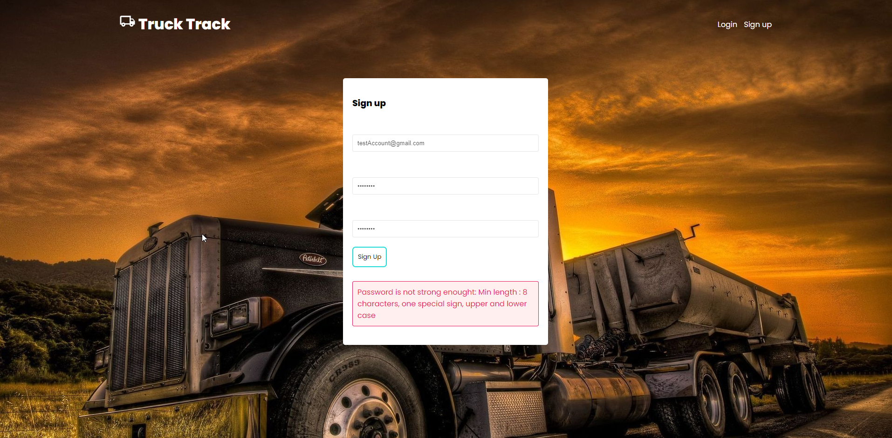
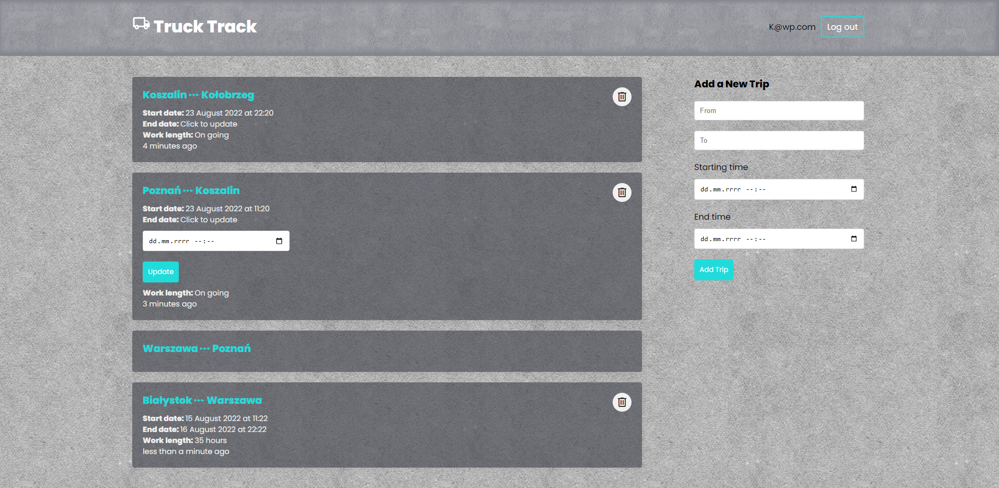
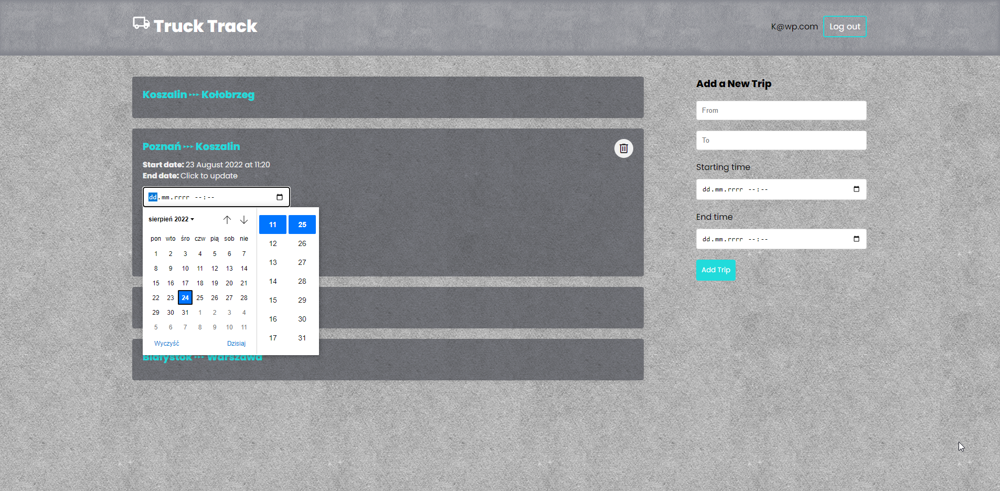

# Truck Track
> Web application created for Truck drivers to collect their daily roads and work times
> Live demo is not available yet <!-- [_here_](https://www.example.com). -->

## Table of Contents
* [General Info](#general-information)
* [Technologies Used](#technologies-used)
* [Features](#features)
* [Screenshots](#screenshots)
* [Setup](#setup)
* [Usage](#usage)
* [Project Status](#project-status)
* [Room for Improvement](#room-for-improvement)
* [Contact](#contact)
<!-- * [License](#license) -->

## General Information
- When you work as a driver you want to store your trips somewhere in database.
- One of my familly memmber is a driver and asked me for that kind of application which I am happy to develop with MERN stack in learning purposes
<!-- - What problem does it (intend to) solve?
- What is the purpose of your project?
- Why did you undertake it? -->

## Technologies Used
- NodeJs - version 16.16.0
- Express - version 4.18.1
- React - version 18.2.0
- Mongoose - version 6.5.2

## Features
<!-- List the ready features here: -->
- Adding trips to database based on MongoDB Atlas (collecting trace rout, date of start and end trip)
- Recive and manage data from db to UI and vice versa
- Sign up user with JSON Web Token and connect every user with database
- Store JWT Token in localStorage to keep user logged in for max 3 days

## Screenshots

## Setup
Make sure to prepare your own .env file and database with every credentials which I don't provide here.

## Project Status
Project is: _in progress_ 
<!-- / _complete_ / _no longer being worked on_. If you are no longer working on it, provide reasons why. -->

## Room for Improvement
<!-- Include areas you believe need improvement / could be improved. Also add TODOs for future development. -->

Room for improvement:
- style of calendar should be changed
- delete button shouldn't be so easy to tap w/o a prompt of confirmation

To do:
- Implement login with social media logins like google and facebook.
- some visual changes
- add vehicle mileage to database and calculate daily trip length

## Contact
Created by [@kamilkasiak] - feel free to contact me!

